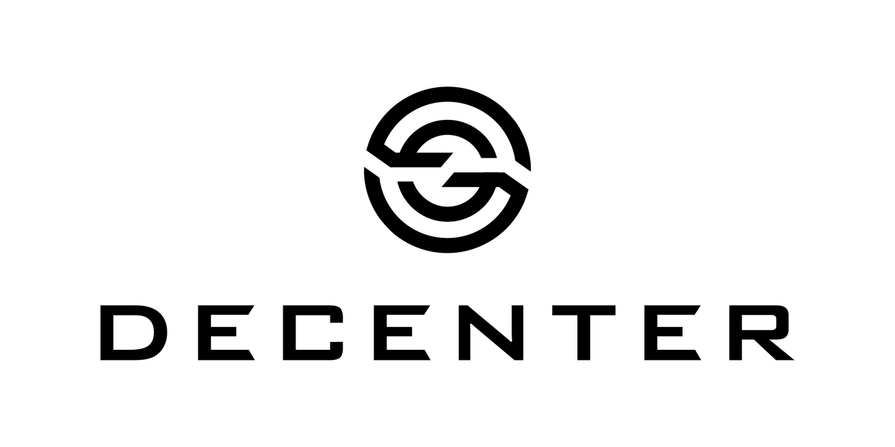

# 💡 RateX SDK

<div style='flex: 0.2; align="center"'>

</div>

## 🌟 Introduction

RateX SDK is a tool for developers to seamlessly integrate DEX aggregation functionality into their applications on Ethereum and Arbitrum. This open-source SDK helps you find optimal swap routes across multiple decentralized exchanges, offering competitive rates without taking positive slippage or fees. With RateX SDK, you can fetch quotes and generate transaction data for executing swaps through our smart contracts, while ensuring transparency and control over the routing process.

### Why are we making this?

Current DEX aggregators may not charge fees but often take positive slippage, which is the difference between the expected price and the actual execution price of a trade. Additionally, their routing algorithms are typically closed source, leaving users vulnerable if these services start charging fees.

Our goal is to create a competitive alternative by:

- Not taking positive slippage or fees
- Making our routing algorithm open source
- Running the code (SDK) directly on the user's machine (in browser), rather than on a server

## ✨ Features

- 🔍 **Best route finding** across multiple DEXes
- 💰 **No fees or positive slippage** taken
- 🖥️ **Client-side execution** instead of servers
- 🔓 **Open-source routing algorithm**
- ⚡ **Support for Arbitrum and Ethereum networks**

## 🛠️ Supported DEXes

| DEX                       | Supported |
| ------------------------- | :-------: |
| Uniswap V2                |    ✅     |
| Uniswap V3                |    ✅     |
| Sushiswap V2              |    ✅     |
| Balancer (weighted pools) |    ✅     |
| Camelot                   |    ✅     |

## 📦 Installation

```bash
npm install ratex-sdk
```

or with yarn

```bash
yarn add ratex-sdk
```

## 🚀 Quick Start

### JavaScript

```javascript
const { RateX, Dexes } = require("ratex-sdk");

async function main() {
  const rateX = new RateX({
    rpcUrl: "https://arb1.arbitrum.io/rpc",
    chainId: 42161,
    dexes: [Dexes.UNISWAP_V2, Dexes.UNISWAP_V3],
    graphApiKey: "YOUR_GRAPH_API_KEY",
  });

  const tokenIn = "0xC02aaA39b223FE8D0A0e5C4F27eAD9083C756Cc2"; // WETH
  const tokenOut = "0x6B175474E89094C44Da98b954EedeAC495271d0F"; // DAI
  const amountIn = BigInt("1000000000000000000"); // 1 WETH

  const quote = await rateX.getQuote(tokenIn, tokenOut, amountIn);
  console.log("Best quote:", quote);

  const swapParams = await rateX.getSwapParameters(
    tokenIn,
    tokenOut,
    amountIn,
    1, // 1% slippage
    "0xYourAddress",
    30 // 30 minutes deadline
  );
  console.log("Swap parameters:", swapParams);
}

main().catch(console.error);
```

### TypeScript

```typescript
import { RateX, Dexes } from "ratex-sdk";

async function main() {
  const rateX = new RateX({
    rpcUrl: "https://arb1.arbitrum.io/rpc",
    chainId: 42161,
    dexes: [Dexes.UNISWAP_V2, Dexes.UNISWAP_V3],
    graphApiKey: "YOUR_GRAPH_API_KEY",
  });

  const tokenIn: string = "0xC02aaA39b223FE8D0A0e5C4F27eAD9083C756Cc2"; // WETH
  const tokenOut: string = "0x6B175474E89094C44Da98b954EedeAC495271d0F"; // DAI
  const amountIn: bigint = BigInt("1000000000000000000"); // 1 WETH

  const quote = await rateX.getQuote(tokenIn, tokenOut, amountIn);
  console.log("Best quote:", quote);

  const swapParams = await rateX.getSwapParameters(
    tokenIn,
    tokenOut,
    amountIn,
    1, // 1% slippage
    "0xYourAddress",
    30 // 30 minutes deadline
  );
  console.log("Swap parameters:", swapParams);
}

main().catch(console.error);
```

## 📚 API Reference

### `RateX`

#### Constructor

```javascript
new RateX(config: RateXConfig)
```

- `config.rpcUrl`: RPC URL for the Arbitrum network
- `config.chainId`: Chain ID (42161 for Arbitrum One)
- `config.dexes`: Array of DEXes to include in routing (optional)
- `config.graphApiKey`: Your Graph API key

#### Methods

##### `getQuote`

```javascript
async getQuote(tokenIn: string, tokenOut: string, amountIn: bigint): Promise<Quote>
```

Finds the best swap route and returns a quote.

##### `getSwapCalldata`

```javascript
async getSwapCalldata(
  tokenIn: string,
  tokenOut: string,
  amountIn: bigint,
  slippagePercentage: number,
  recipient: string,
  deadlineInMinutes: number
): Promise<string>
```

Generates the calldata for executing the swap.

##### `getSwapParameters`

```javascript
async getSwapParameters(
  tokenIn: string,
  tokenOut: string,
  amountIn: bigint,
  slippagePercentage: number,
  recipient: string,
  deadlineInMinutes: number
): Promise<SwapParams>
```

Prepares the parameters for calling the RateX contract.

## 📄 License

This project is licensed under the MIT License - see the [LICENSE](LICENSE-MIT) file for details.

## 🙏 Acknowledgements

Special thanks to [Decenter](https://www.decenter.com/) internship teams for supporting this project and all the contributors who made this possible.

## 📬 Contact

For any questions or support, please open an issue on our [GitHub repository](https://github.com/your-repo-link).

---

Built with ❤️ by the RateX team
